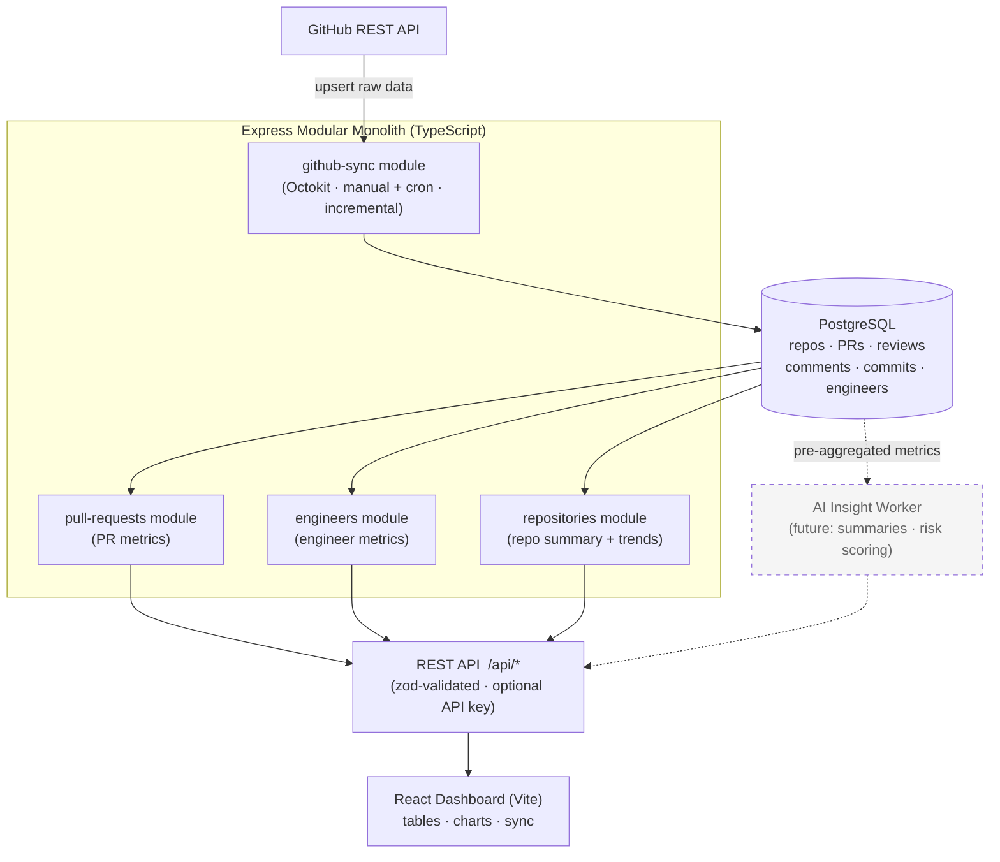
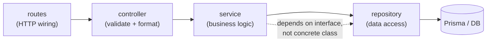
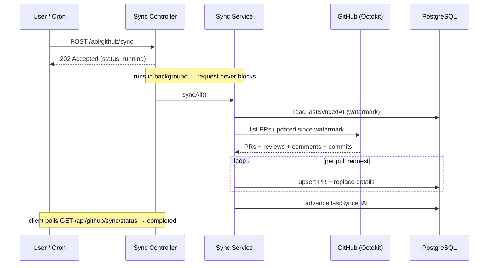
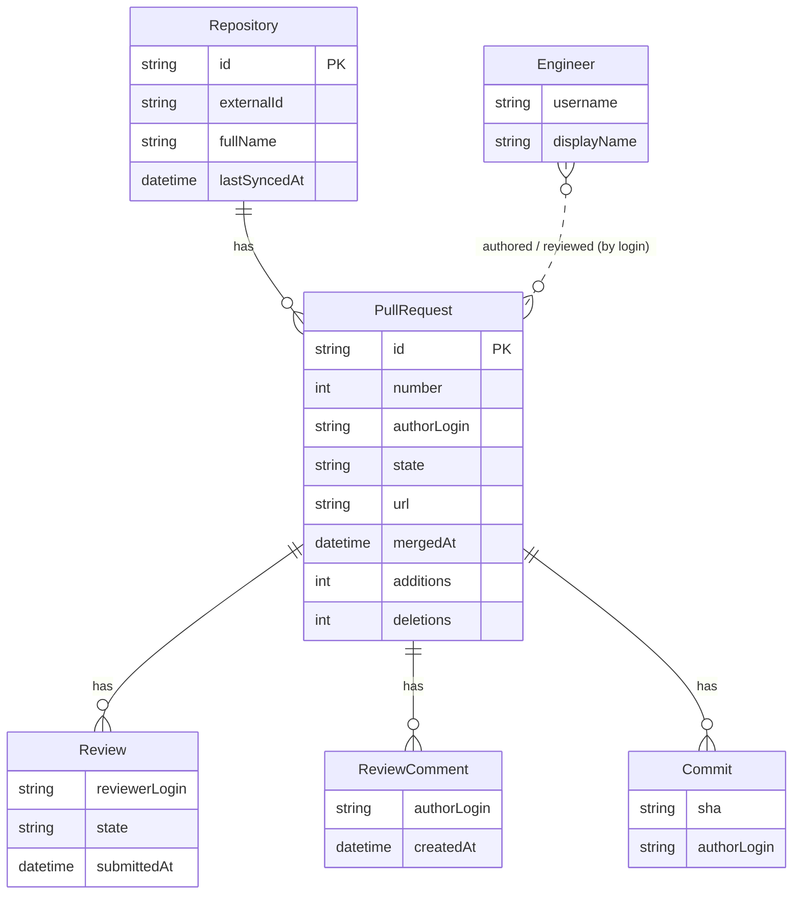
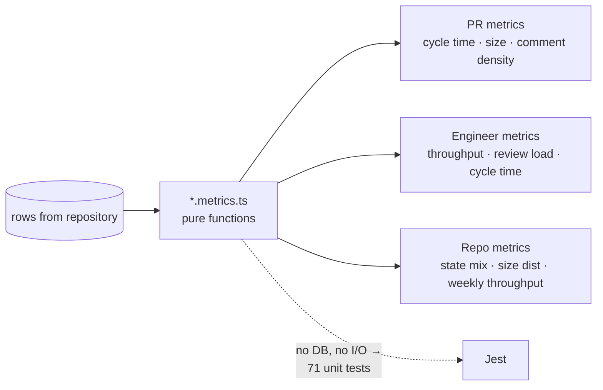

# PR Intelligence Platform — Diagrams

> Mermaid diagrams. They render automatically on GitHub and in VS Code (install the
> "Markdown Preview Mermaid Support" extension, then open Preview). For the video you can
> screenshot the rendered diagrams or share this file in Preview mode.

---

## 1. System Architecture (high level)

The four-stage flow: **Sync → Store → Serve → Visualize.**

---

## 2. Internal Module Layering (same in every module)

Strict one-way dependency flow — this is what keeps modules testable and swappable.

---

## 3. Sync Flow (async + incremental)

Why the manual sync returns instantly and why repeat syncs are cheap.

---

## 4. Data Model

---

## 5. Metrics Layer (pure functions)

Metric math is isolated from data access — the highest-risk logic, made the easiest to test.

